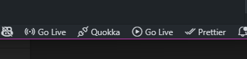
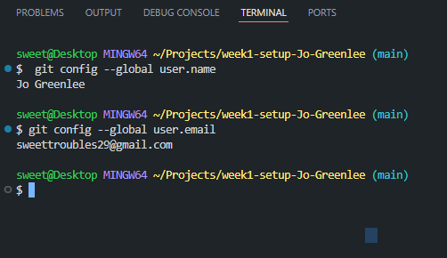
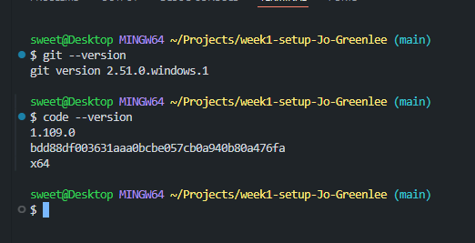
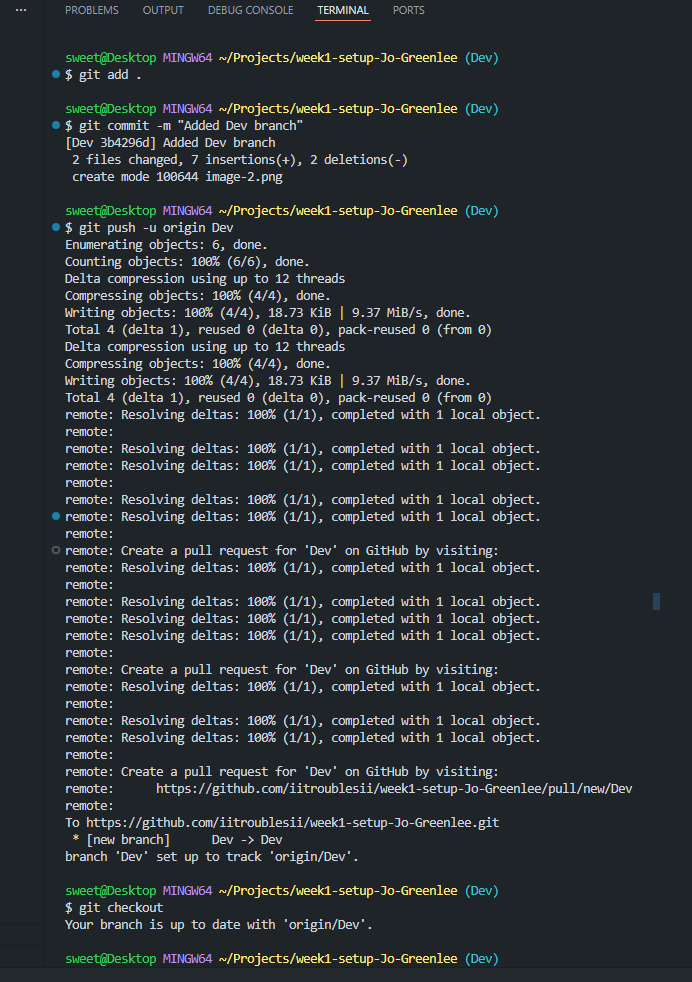
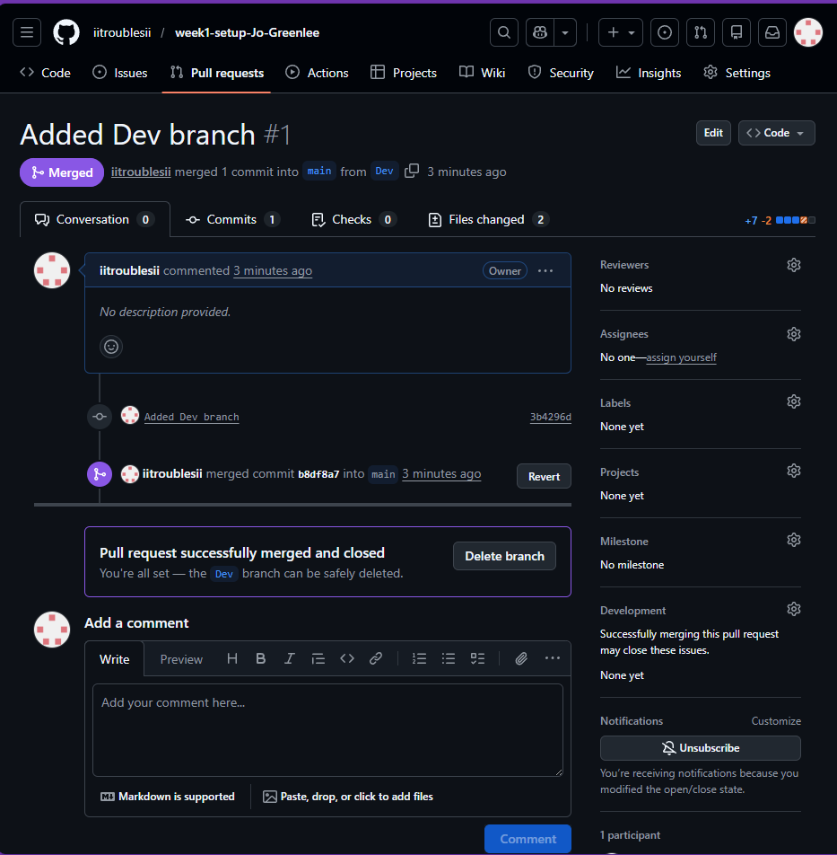
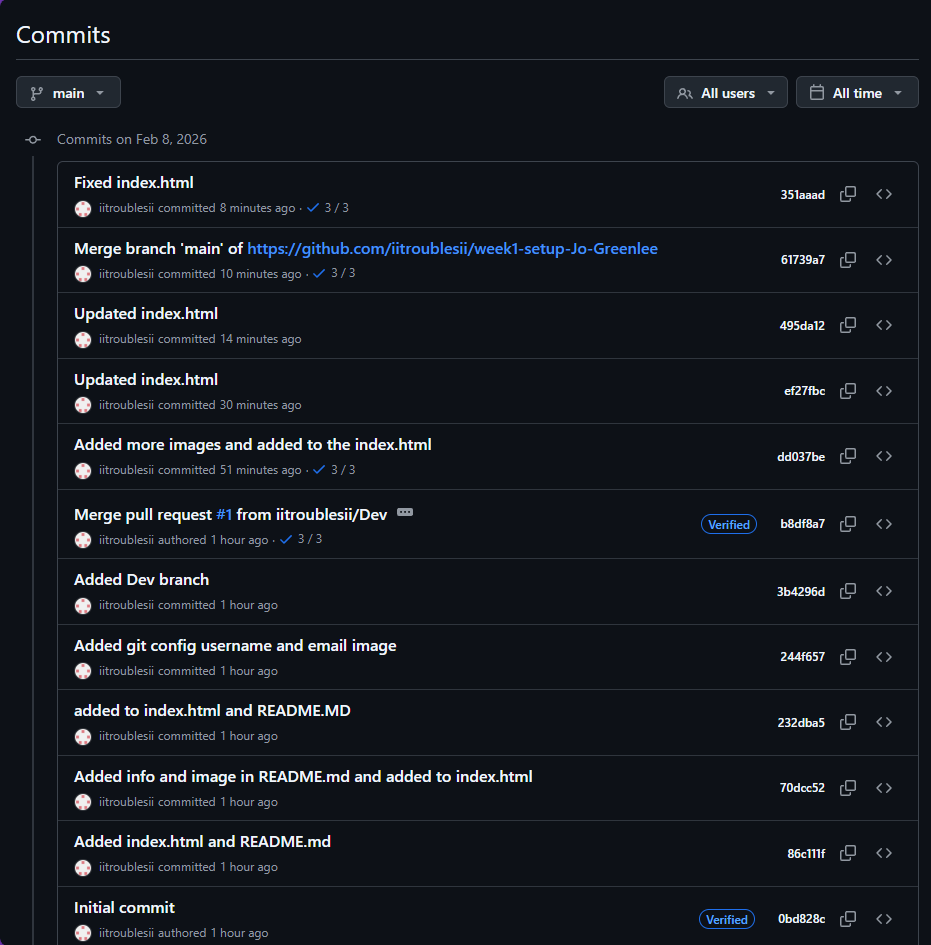

# Week1-Setup

## System Info

- Windows 11, version 25H2
- Git Version 2.51.0.windows.1
- VsCode Version 1.109.0
  bdd88df003631aaa0bcbe057cb0a940b80a476fa
  x64

## Images of Installations and Versions

- Screenshot showing Prettier and Live-Server is installed
  

- Screenshot showing Global username and Email
  

- Screenshot showing the versions of git and VSCode
  

- Screenshot of adding a Dev Branch
  

- Screenshot of the Merge and Pull Request
  

- Screenshot of the commits
  
  (Idk what I pressed or did for the commit merge branch "main" of <https://github.com/iitroublesii/week1-setup-Jo-Greenlee>)
